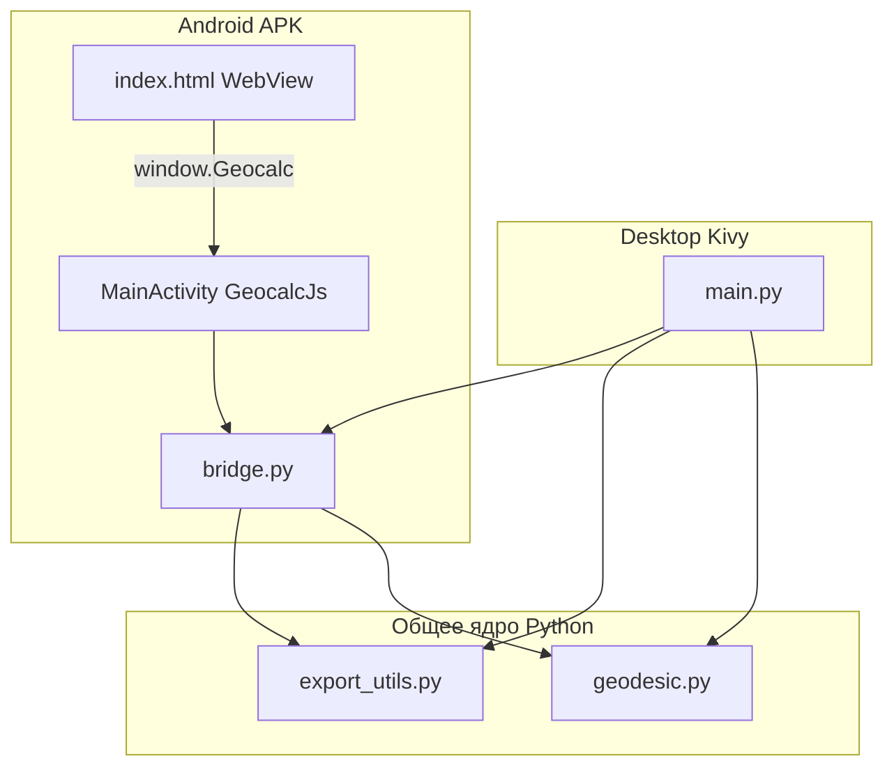

## Содержание

- [Возможности](#возможности)
- [Архитектура](#архитектура)
- [Структура репозитория](#структура-репозитория)
- [Модули Python](#модули-python)
- [Интерфейс](#интерфейс)
- [Мост Android (WebView → Python)](#мост-android-webview--python)
- [Потоки данных](#потоки-данных)
- [Сборка и запуск](#сборка-и-запуск)
- [Зависимости и технологии](#зависимости-и-технологии)
- [Ограничения и допущения](#ограничения-и-допущения)

---

## Возможности

### ОГЗ — обратная геодезическая задача

По координатам двух точек на эллипсоиде вычисляются:

- **A1** — прямой геодезический азимут в начальной точке;
- **A2** — обратный азимут в конечной точке;
- **s** — длина геодезической линии (метры).

Точки в интерфейсе:

| Точка | Поля | Назначение |
|-------|------|------------|
| Точка стояния | B1, L1 | Станция; от неё выполняется ПГЗ |
| Точка ориентирования | B2, L2 | Заданное направление для исходного азимута A1 |

Дополнительно задаются параметры эллипсоида: **a**, **e²** и число **итераций** (по умолчанию WGS-84 и 4 итерации).

### ПГЗ — полярная засечка

От точки стояния (точка 1 из ОГЗ) последовательно откладываются направления и расстояния. Каждая строка — **горизонтальный угол (ГУ)** в DMS и **расстояние s** в метрах.

Азимут луча: **A = A1 + ГУ**.

Для каждой вычисленной точки (№ 3, 4, …) в результате выводятся:

- широта **B** и долгота **L** (DMS);
- **A** — прямой азимут направления;
- **Aобр** — обратный азимут в конечной точке.

### Экспорт

После расчёта ОГЗ и ПГЗ доступны три формата:

| Формат | Описание |
|--------|----------|
| **PDF** | Ведомость координат (таблица: №, Широта B, Долгота L) + шапка с параметрами эллипсоида и исходными точками |
| **KML** | Точки и лучи от станции для Google Earth и аналогов |
| **Карта** | HTML-страница с Leaflet (OpenStreetMap), маркеры и линии |

Файлы сохраняются в каталог `exports/` (на ПК) или во внутреннее хранилище приложения на Android.

---

## Архитектура

Приложение построено по принципу **общего ядра расчётов** и **двух независимых UI-слоёв**:



- **Android:** WebView загружает `index.html`; JavaScript инициализирует пакеты Python через Chaquopy (`bridge.py`).
- **Desktop:** Kivy-приложение (`main.py`) напрямую использует `geodesic.py`, `export_utils.py` и `bridge.py`.
- **Ядро:** Python без привязки к UI — удобно тестировать и переиспользовать.

---

## Структура репозитория

```
app_py/
├── geodesic.py              # ОГЗ, ПГЗ, DMS-утилиты
├── bridge.py                # JSON-API для Android и main.py
├── export_utils.py          # PDF, KML, HTML-карта
├── main.py                  # UI (Kivy)
├── build_apk.py             # Сборка debug-APK (Windows, Gradle + Chaquopy)
├── buildozer.spec           # Альтернативная сборка (Buildozer / CI)
├── requirements.txt         # Зависимости версии
├── make_icon.py             # Генерация иконки приложения
│
├── assets/
│   ├── icon.svg             # Исходный файл иконки
│   └── fonts/               # DejaVu Sans (кириллица в PDF)
│
├── android/                 # Нативный Android-проект
│   ├── app/
│   │   ├── build.gradle     # Chaquopy, Python 3.13, fpdf2
│   │   └── src/main/
│   │       ├── assets/index.html    # UI телефона
│   │       ├── java/.../MainActivity.java
│   │       └── AndroidManifest.xml
│   └── build.gradle
│
├── exports/                 # Результаты экспорта
├── bin/                     # geocalc-debug.apk - приложение
└── .github/workflows/       # CI: Buildozer
```

При сборке APK скрипт `build_apk.py` копирует `geodesic.py`, `bridge.py` и `export_utils.py` в `android/app/src/main/python/`

Служебные каталоги (не описывают логику приложения): `.tools/` (portable JDK, Gradle), `android/app/build/`, `%LOCALAPPDATA%/geocalc-build/` (SDK и staging).

---

## Модули Python

### `geodesic.py`

Ядро геодезических вычислений. Константы по умолчанию: WGS-84 (`a = 6378137 м`, `e² = 0.00669437999014`).

| Функция | Назначение |
|---------|------------|
| `dms_to_deg`, `deg_to_dms`, `format_dms` | Преобразование и форматирование DMS |
| `normalize_deg_0_360`, `normalize_lon` | Нормализация углов |
| `inverse_geodetic_problem` | **ОГЗ** — итерационный метод (формулы 28–50 методички) |
| `direct_geodetic_problem` | **Прямая задача** — координаты конечной точки по азимуту и расстоянию |
| `polar_points_from_station` | **ПГЗ** — цепочка ног `(ГУ, s)` от точки 1 |

Особенность реализации ОГЗ: в используемой лабораторной схеме **расстояние s не зависит от большой полуоси a** (параметр передаётся, но в формулах расстояния не участвует).

### `bridge.py`

JSON-мост между UI и ядром. Все функции принимают/возвращают строки JSON.

| Функция | Вызов | Описание |
|---------|-------|----------|
| `set_export_dir(path)` | Android при старте | Задаёт каталог для PDF/KML/HTML |
| `solve_ogz(payload)` | `Geocalc.ogz()` / main.py | ОГЗ; валидация DMS, a, e², итераций |
| `solve_polar(payload)` | `Geocalc.polar()` / main.py | ПГЗ; legs = [{deg, min, sec, s}, …] |
| `export_bundle(payload, kind)` | `Geocalc.exportFile()` | `kind`: `pdf`, `kml`, `map` |

Пример ответа ОГЗ:

```json
{
  "B1_deg": 55.756,
  "L1_deg": 37.617,
  "A1_deg": 42.5,
  "A1_dms": "42° 30′ 00.0″",
  "A2_dms": "...",
  "s_m": 1234.567
}
```

Пример ответа ПГЗ (массив точек):

```json
[
  {
    "number": 3,
    "B_deg": 55.76,
    "L_deg": 37.62,
    "B_dms": "55° 45′ 36.0″",
    "L_dms": "...",
    "A_dms": "...",
    "A_rev_dms": "..."
  }
]
```

### `export_utils.py`

| Функция | Назначение |
|---------|------------|
| `write_pdf(points, meta)` | PDF-ведомость (fpdf2, шрифт DejaVu Sans) |
| `write_kml(points, meta)` | KML с точками и лучами от станции |
| `write_map_html(points)` | HTML + Leaflet (CDN) |
| `open_path(path, mime)` | Открытие файла на ПК (webbrowser / plyer) |
| `export_dir()` | Путь к каталогу экспорта |

---

## Интерфейс

### Android — `android/app/src/main/assets/index.html`

- Аккордеон из трёх секций: **ОГЗ**, **ПГЗ**, **Экспорт**.
- В свёрнутом виде три крупные кнопки занимают экран; при раскрытии секции — форма ввода.
- ОГЗ: блоки «Точка стояния» (B1, L1) и «Точка ориентирования» (B2, L2); поля a, e², Итерации.
- ПГЗ: строки «ГУ (° ′ ″) + расстояние s»; кнопки «+» / «−» для строк.
- Ошибки валидации — модальное окно (message box).
- Минималистичный плоский стиль: фон `#fafafa`, белые карточки, акцент `#2563eb`.

### Desktop — `main.py` (Kivy)

Зеркальная функциональность с тем же минималистичным оформлением:

| Класс | Роль |
|-------|------|
| `FlatButton` | Плоские кнопки (primary / outline) |
| `DmsUnit`, `DmsRow` | Поля ввода ° ′ ″ |
| `PlainField` | Текстовые поля (a, e², расстояние) |
| `AccordionItem` | Секции аккордеона |
| `MessageBox` | Модальные сообщения об ошибках |
| `GeodesicCalculatorApp` | Главное приложение |

Окно по умолчанию: 420×780 px (только не-Android).

---

## Мост Android (WebView → Python)

Файл: `android/app/src/main/java/org/miigaik/geocalc/MainActivity.java`

1. При старте инициализируется **Chaquopy** (Python 3.13).
2. Вызывается `bridge.set_export_dir` для каталога `files/exports`.
3. **WebView** загружает `file:///android_asset/index.html`.
4. Класс `GeocalcJs` регистрируется как `window.Geocalc`:

| JS-метод | Python |
|----------|--------|
| `Geocalc.ogz(jsonString)` | `bridge.solve_ogz` |
| `Geocalc.polar(jsonString)` | `bridge.solve_polar` |
| `Geocalc.exportFile(jsonString, kind)` | `bridge.export_bundle` + открытие через FileProvider |

Ошибки Python возвращаются как `{"error": "текст"}`.

Пакет приложения: `org.miigaik.geocalc`. Min SDK: 24, target/compile SDK: 34.

---

## Потоки данных

### Расчёт ОГЗ (телефон)

1. Пользователь заполняет B1, L1, B2, L2, a, e², итерации в `index.html`.
2. JavaScript собирает JSON и вызывает `Geocalc.ogz(payload)`.
3. `MainActivity` → `bridge.solve_ogz` → `inverse_geodetic_problem`.
4. JSON с A1, A2, s возвращается в UI; результат показывается под кнопкой «Вычислить».

### Расчёт ПГЗ (телефон)

1. Требуется предварительный расчёт ОГЗ (сохраняется `ogz` в JS).
2. Для каждой строки: ГУ (DMS) + s → массив `legs`.
3. `Geocalc.polar(JSON)` → `polar_points_from_station(B1, L1, A1, legs, a, e2)`.
4. Для каждой точки: B, L, A (прямой), Aобр (обратный) в DMS.

### Экспорт

1. Проверка: есть результаты ОГЗ и ПГЗ.
2. Формируется массив `points` (точки 1, 2 + вычисленные) и `meta` (a, e², координаты, A1).
3. `Geocalc.exportFile(payload, kind)` → файл на диске → Intent «Открыть» (PDF/KML/HTML).

---

## Сборка и запуск

### Десктоп (Windows / Linux / macOS)

**Требования:** Python 3.10+ (рекомендуется 3.13), Kivy.

```bash
pip install -r requirements.txt
python main.py
```

Зависимости из `requirements.txt`: `kivy`, `fpdf2`, `plyer`.

### Android APK (локально, Windows)

**Требования:**

- Python 3.13 (путь к интерпретатору используется Gradle/Chaquopy)
- Portable JDK 17 в `.tools/jdk-17.0.20.1+1/` (или будет скопирован в `%LOCALAPPDATA%\geocalc-build\`)
- Android SDK и Gradle 8.7 — скачиваются/распаковываются скриптом при первой сборке

```bash
python build_apk.py
```

Результат: `bin/geocalc-debug.apk`.

Скрипт:

1. Создаёт staging-копию проекта в `%LOCALAPPDATA%\geocalc-build\src\`
2. Копирует Python-модули и шрифты в Android-проект
3. Запускает `gradle assembleDebug`
4. Копирует APK в `bin/`

### CI (GitHub Actions)

Workflow `.github/workflows/build-apk.yml` — сборка через **Buildozer** (`kivy/buildozer-action`). Альтернативный путь; основной для Windows — `build_apk.py`.

---

## Зависимости и технологии

| Компонент | Технология |
|-----------|------------|
| Язык расчётов | Python 3.13 |
| Desktop UI | Kivy 2.3+ |
| Mobile UI | HTML / CSS / JavaScript (WebView) |
| Python на Android | [Chaquopy](https://chaquo.com/chaquopy/) |
| Сборка Android | Gradle 8.7, Android SDK 34 |
| PDF | fpdf2, DejaVu Sans |
| Карта | Leaflet 1.9 (CDN), OpenStreetMap |
| KML | XML вручную |

---

## Ограничения и допущения

- Формулы соответствуют **лабораторной работе МИИГАиК**; для производственной геодезии может потребоваться верификация.
- В интерфейсе координаты и углы — **только DMS**; десятичные градусы в UI не отображаются.
- Эллипсоид по умолчанию — **WGS-84**; a и e² можно изменить вручную.
- ОГЗ: расстояние s в коде **не зависит от a** (особенность выбранной методики).
- ПГЗ: все вычисленные точки отсчитываются от **точки 1 (станции)**; азимут каждой ноги = A1 + ГУ (не накопление от предыдущей вычисленной точки).
- Экспорт PDF: таблица из **трёх столбцов** (№, B, L); столбец «Примечание» не выводится.
- Лицензия в репозитории не указана.

---

## Краткое описание для профиля GitHub

> **Геодезический калькулятор** — Android + desktop приложение на Python для ОГЗ и полярной засечки на эллипсоиде WGS-84. Два UI (Kivy / WebView), общее ядро `geodesic.py`, экспорт PDF/KML/Leaflet. Сборка APK: Gradle + Chaquopy.
